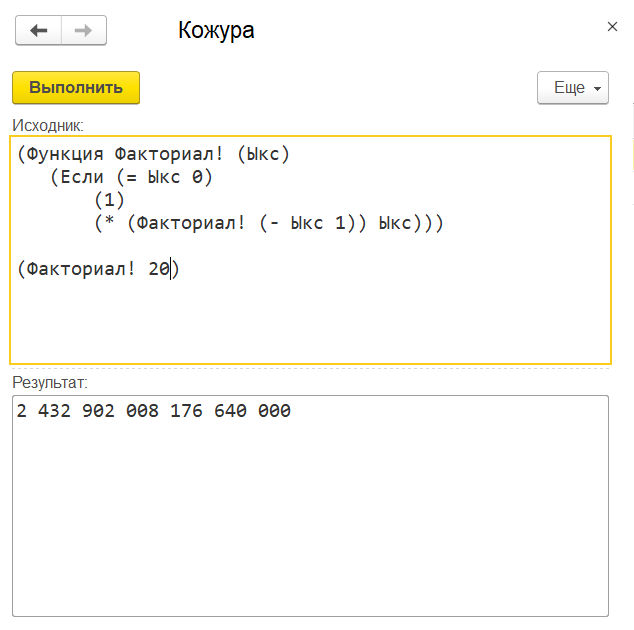

# kojura

## Дисклеймер
Этот проект является экспериментом и у автора нет никах планов на него. Диагностика и контроль семантики очень слабые и бажные.
Кроме того, синтаксис и семантика в Кожуре оригинальные и знание языков семейства Lisp вам не поможет.
Автор сам не понимает что происходит и как это работает. От скобок текут слезы, а отладка программ на Кожуре доставляет боль.
Хвостовая рекурсия не оптимизируется и это позволяет уронить платформу одной строчкой кода.
Наличие функций высшего порядка и Лямбд возволяет писать код, который через пять минут не способен понять даже автор.

## Общие положения
Программа - это последовательность выражений
Выражение - это либо число, либо строка, либо идентификатор, либо вызов функции
Число - это последовательность цифр, которая может включать десятичную точку
Строка - это последовательность символов в двойных кавычках
Идентификатор - это последовательность любых символов из разрешенных, если первый символ не цифра и не двойная кавычка
Разрешенные символы - `abcdefghijklmnopqrstuvwxyzABCDEFGHIJKLMNOPQRSTUVWXYZ_=+-*/<>%!?0123456789абвгдеёжзийклмнопрстуфхцчшщъыьэюяАБВГДЕЁЖЗИЙКЛМНОПРСТУФХЦЧШЩЪЫЬЭЮЯ`
Вызов функции - это последовательность выражений в круглых скобках
## Встроенные функции

* `+` - складывает первый аргумент с остальными по порядку
* `-` - вычитает из первого аргумента остальные по порядку; если аргумент один, то работает как унарный минус
* `*` - умножает первый аргумент на остальные по порядку
* `/` - делит первый аргумент на остальные по порядку
* `%` - берет остаток от деления первого аргумента на остальные по порядку
* `=` - возвращает `Истина` если все аргументы равны, иначе `Ложь` (работает лениво)
* `>` - возвращает `Истина` если во всех парах аргументов левый больше правого, иначе `Ложь` (работает лениво)
* `<` - возвращает `Истина` если во всех парах аргументов левый меньше правого, иначе `Ложь` (работает лениво)
* `>=` - возвращает `Истина` если во всех парах аргументов левый больше правого или равен ему, иначе `Ложь` (работает лениво)
* `<=` - возвращает `Истина` если во всех парах аргументов левый меньше правого или равен ему, иначе `Ложь` (работает лениво)
* `<>` - возвращает `Истина` если во всех парах аргументов левый не равен правому, иначе `Ложь` (работает лениво)
* `И` - возвращает `Истина` если все аргументы равны `Истина`, иначе `Ложь` (работает лениво)
* `Или` - возвращает `Истина` если хотя бы один аргумент равен `Истина`, иначе `Ложь` (работает лениво)
* `Не` - возвращает `Истина` если все аргументы равны `Ложь` (работает лениво)
* `Функция` - создает новую функцию и помещает в текущее окружение
  * форма 1: `(Функция ИмяФункции ИмяПараметра Выражение {Выражение})`
  * форма 2: `(Функция ИмяФункции (ИмяПараметра {ИмяПараметра}) Выражение {Выражение})`
* `Если` - возвращает одно из двух выражений по условию (работает лениво)
  * форма: `(Если БулевоВыражение ВыражениеЕслиИстина ВыражениеЕслиЛожь)`
* `Выбор` - возвращает одно из выражений по порядку по условию (работает лениво)
  * форма `(Выбор ВыражениеКогда ВыражениеТогда {ВыражениеКогда ВыражениеТогда})`
* `Пусть` - создает неизменяемую переменную и помещает ее в текущее окружение
  * форма: `(Пусть ИмяПеременной Выражение)`
* `Лямбда` - создает анонимную функцию
  * форма 1: `(Функция ИмяПараметра Выражение {Выражение})`
  * форма 2: `(Функция (ИмяПараметра {ИмяПараметра}) Выражение {Выражение})`
* `Сообщить` - выводит аргументы в панель сообщений (консоль)
  * форма: `(Сообщить Выражение {Выражение})`
* `Список` - создает список
  * форма: `(Список Выражение {Выражение})`
* `Морда` - получает значение первого элемента списка
  * форма: `(Морда Выражение)`
* `Хвост` - создает новый список из данного исключением первого элемента
  * форма: `(Хвост Выражение)`

## Константы

* `Истина` - возвращает `Истина`
* `Ложь` - возвращает `Ложь`
* `Неопределено` - возвращает `Неопределено`